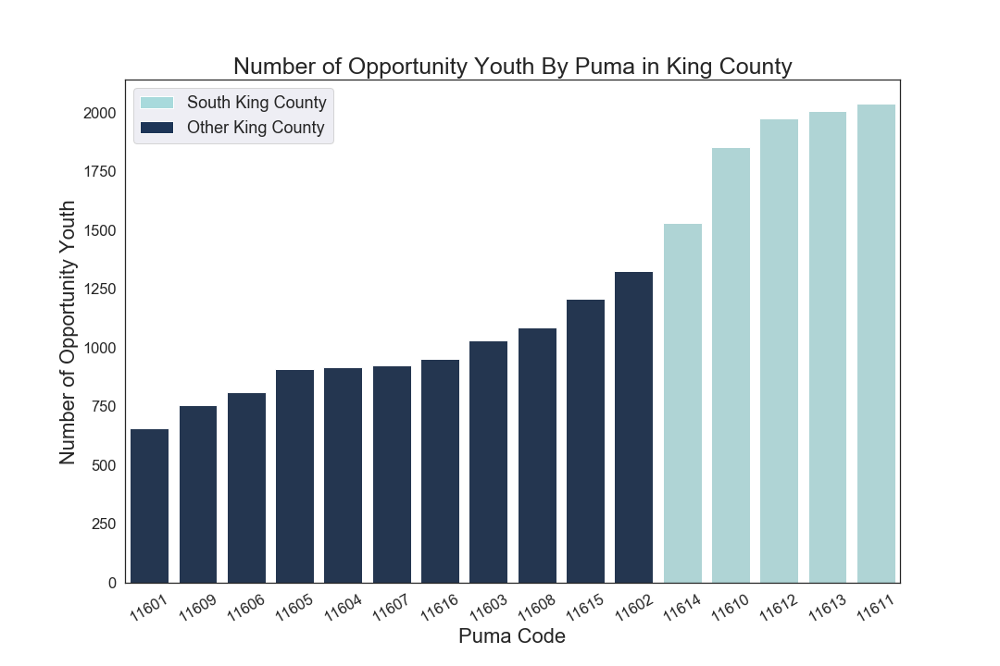
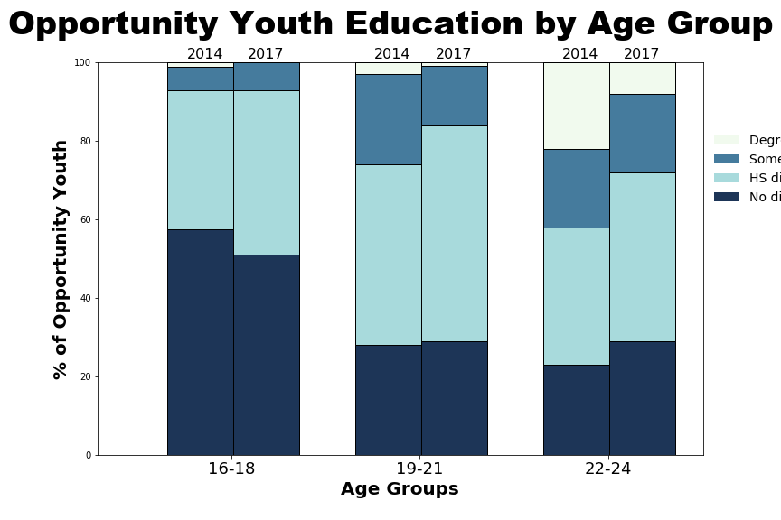
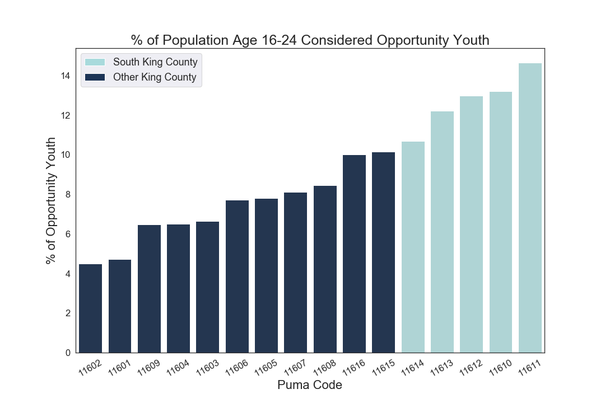
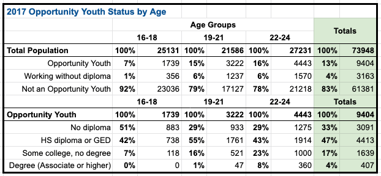

# Table of Contents

<!--ts-->
 * [Files and Folders of Note](https://github.com/chum46/mod-1-project-chicago-seattle-ds-051120#files-and-folders-of-note)
 * [General Setup Instructions](https://github.com/chum46/mod-1-project-chicago-seattle-ds-051120#general-setup-instructions)
 * [Context of Project](https://github.com/chum46/mod-1-project-chicago-seattle-ds-051120#context-of-project)
 * [Preview of Results](https://github.com/chum46/mod-1-project-chicago-seattle-ds-051120#preview-of-results)
 * [Data](https://github.com/chum46/mod-1-project-chicago-seattle-ds-051120#data)
 * [Process](https://github.com/chum46/mod-1-project-chicago-seattle-ds-051120#process)
 * [Results](https://github.com/chum46/mod-1-project-chicago-seattle-ds-051120#results)
 * [Strengths and Limitations](https://github.com/chum46/mod-1-project-chicago-seattle-ds-051120#strengths-and-limitations)
 * [Real World Application](https://github.com/chum46/mod-1-project-chicago-seattle-ds-051120#real-world-application)
<!--te-->

# Files and Folders of Note
```
├── README.md
├── environment.yml
├── notebooks
│   ├── exploratory
│   │   ├── 01_erh_download_and_explore_data.ipynb
│   │   ├── 02_cm_download_and_explore_data.ipynb
│   │   ├── 03_mc_download_and_explore_data.ipynb
│   │   ├── 04_ar_download_and_explore_data.ipynb
│   │   ├── 05_ar_map_visualization.ipynb
│   │   ├── 06_mc_oy_estimate_viz.ipynb
│   │   ├── 07_cm_trend_table_viz.ipynb
│   └── report
│       ├── 08_all_final_summary.ipynb
├── references
├── reports
│   ├── figures
│   │   ├── oy_by_age.png
│   │   ├── oy_by_puma.png
│   │   └── percent_oy_by_puma.png
│   └── presentation.pdf
├── src
│   ├── data
│   ├── mc_functions.py
│   └── requirements
│       └── install.sh
└── windows.yml
```
#### Repo Navigation Links
 - [system requirements](https://github.com/chum46/mod-1-project-chicago-seattle-ds-051120/tree/master/src/requirements)
 - [data download](https://github.com/chum46/mod-1-project-chicago-seattle-ds-051120/blob/master/notebooks/exploratory/01_erh_download_and_explore_data.ipynb)
 - [final summary notebook](https://github.com/chum46/mod-1-project-chicago-seattle-ds-051120/blob/master/notebooks/report/08_all_final_summary.ipynb)
 - [exploratory notebooks folder](https://github.com/chum46/mod-1-project-chicago-seattle-ds-051120/tree/master/notebooks/exploratory)
 - [src folder](https://github.com/chum46/mod-1-project-chicago-seattle-ds-051120/tree/master/src)
 - [references](https://github.com/chum46/mod-1-project-chicago-seattle-ds-051120/tree/master/references)
 
# General Setup Instructions 
<sup>note: each command may take anywhere from 10-20 minutes depending on internet speed</sup>

If you are missing required software (e.g. Anaconda, PostgreSQL), please run the following command in Bash (designed for Mac computers):
```bash
# installs necessary requirements
sh src/requirements/install.sh
```
For Windows and Linux computers, you may need to manually ensure that you have installed [Anaconda](https://docs.anaconda.com/anaconda/install/) and [PostgreSQL](https://www.enterprisedb.com/downloads/postgres-postgresql-downloads).

### `oy-env` conda Environment

This project relies on you using the [`environment.yml`](environment.yml) file to recreate the `oy-env` conda environment. To do so, please run the following commands *in your terminal*:
```bash
# create the oy-env conda environment
conda env create -f environment.yml
# activate the oy-env conda environment
conda activate oy-env
# if needed, make oy-env available to you as a kernel in jupyter
python -m ipykernel install --user --name oy-env --display-name "Python 3 (oy-env)"
```

**Windows Note:** The same versions of these packages are not available for Windows computers, so all Windows users should use the `windows.yml` file instead of `environment.yml` (this file was generated on Windows 10)

**Linux Note:** The same versions of these packages are not available for Linux computers, so all Linux users should use the `linux.yml` file instead of `environment.yml` (this file was generated on Red Hat)

**Catalina Note:** You may need to modify the `prefix` at the very bottom of `environment.yml` if you are on macOS Catalina.  Run `conda env list` in your terminal to determine the appropriate path by looking at the paths of your existing conda environment(s).  Modify `environment.yml` then try running the installation commands listed above again.

On all operating systems, you will know that you have the required software if the following Bash commands do not return error or "not found" messages:

```bash
which conda
conda list geopandas
which psql
```

### Data Download

To download the relevant data, run the following command *in Python*:
```
data_collection.download_data_and_load_into_sql()
```

[Here](https://github.com/chum46/mod-1-project-chicago-seattle-ds-051120/blob/master/notebooks/exploratory/01_erh_download_and_explore_data.ipynb) is an example notebook in the `notebooks/exploratory` directory with this code already added.


# Context of Project

Our project task was to update The Seattle Region Partnership (SRP) on the current estimate of Opportunity Youth in South King County. Furthermore, we were to investigate deeper into the status of Opportunity Youth within South King County such as the total amount in each PUMA code, a breakdown of Opportunity Youth status by age, and also provide a comparison to the previous report.

For the purposes of our analysis, we defined Opportunity Youth as any individual between the ages of 16 and 24 who is not in school and not in the labor force or unemployed. We also defined King County to be the area with PUMA codes 11601-11616 and South King County to be a subset of that area, with PUMA codes 11610-11614.


#### Source: 2017 5-year American Community Survey [ACS](https://www.census.gov/programs-surveys/acs/about.html) Public Use Microdata Survey [PUMS](https://www.census.gov/programs-surveys/acs/technical-documentation/pums.html).


# Preview of Results

The primary purpose of our analysis was to estimate the number of individuals considered to be Opportunity Youth within South King County, which we found to be 9,404. Furthermore, we were to provide a breakdown of the number of Opportunity Youth within each PUMA code of South King County.



This graph shows the number of Opportunity Youth within each PUMA code of King County. The areas in South King County are highlighted. As you can see from the visualization, the areas designated as South King County have more Opportunity Youth than any other part of King County.

Looking at the segmented age groups within the opportunity youth population, we can see some trends over time in the education level (Note: the matplotlib savefig method cuts off the legend, from top to bottom it should read - Degree, Associate or higher; Some college, no degree; HS diploma or GED; No diploma). 



We can see that within the 22-24 age group there was a significant dropoff in the number of degreed Opportunity Youth. When you look at the 19-21 age group, you see an increase in the amount of OY that have a HS diploma or GED, and a shrinking population of those with some college credits. 


# Data
The dataset provided to us was the ACS 2013-2017 5-Year PUMS file containing a sampling of five percent of the population of Washington. This dataset provided extensive information on the individuals surveyed. For the purposes of our analysis, we only utilized a small portion of this data. 

Using our definition of Opportunity Youth from above, we required information on the individuals’ age, PUMA code, school status, work status, and corresponding weight of that observation in order to get an accurate estimate of total number of Opportunity Youth. We also utilized the column for educational attainment that gave the highest level of schooling the given individual obtained. The names of those columns are as follows:

- Age of individual: ‘agep’
- PUMA (Public Use Microdata Area) Code: ‘puma’
- School status: ‘sch’
- Educational attainment: ‘schl’
- Work status: ‘esr’
- Weight of observation: ‘pwgtp’

# Process
Utilizing the python programming language along with the pandas library and SQLite we had isolated the columns we wished to use to help identify the opportunity youth of southern king county. This included people between the age of 16 - 24 who are not in any form of schooling and are not in the labor force or are unemployed who reside in the PUMA’s (Public Use Microdata Areas) of 11610 - 11614. Once This group was isolated from the rest of the ACS 2013-2017 dataset the columns were further divided in order to look into specific topics such as the educational attainment or employment statuses of opportunity youths. To find trends in the data the python libraries matplotlib and seaborn were used to make graphical visualizations to help illustrate the data to better understand its trends. 

# Results

The first step of our analysis was to provide an estimate of the number of Opportunity Youth within South King County, as well as the number of Opportunity Youth within each PUMA code of South King County. To give some context, we wanted to show the number of Opportunity Youth within each PUMA of King County so we could compare South King County to the rest.

By utilizing the columns listed above, we estimate that there are a total of 9,404 Opportunity Youth within South King County.


As you can see from the plot above, the PUMA codes in South King County have a higher number of Opportunity Youth than any other area in King County. Our first thought was that the population of those ages 16-24 may be higher in these areas. Since the population was not consistent across PUMA codes, we decided to plot a relative measurement instead, the percentage of the population ages 16-24 who are considered Opportunity Youth.



This representation breeds the same result. The PUMA codes in South King County have the highest percentage of Opportunity Youth among the 16-24 year old population.

Next, we look at the breakdown of the education level of Opportunity Youth in segmented age groups. Below you'll see a table of the results. 



In order to identify any trends we compared the data to analysis done with 2014 results (Note: the matplotlib savefig method cuts off the legend, from top to bottom it should read - Degree, Associate or higher; Some college, no degree; HS diploma or GED; No diploma): 


We can see that within the 22-24 age group there was a significant dropoff in the number of degreed Opportunity Youth. This could mean that more grads are being hired into the workforce, or less youth are going into higher education. When you look at the 19-21 age group, you see an increase in the amount of OY that have a HS diploma or GED, and a shrinking population of those with some college credits. We can possible deduce that less Youth are taking the next step in getting higher education but we would need more data to support that. It could be that more youth are finishing degrees and getting hired into the work force. Further investigation can be done to confirm this by seeing if the general population in these regions have seen any changes that support this assumption.


# Application

According to an article from the Aspen Institute, “one estimate places the personal and public costs of not changing the trajectories of opportunity youth at $6.3 trillion dollars over the lifetimes of all current opportunity youth” (Aspen Institute). The barriers preventing these individuals from reconnecting with society represent a massive economic burden on society as a whole. Removing the barriers for these individuals and helping them get reconnected with our societal structure will greatly benefit both local economies and the national economy.

Our analysis provides a basis for where relief efforts should be targeted. We found the areas within King County to have the highest number of Opportunity Youth and therefore are the areas we should most invest in. 

The next steps of our project would be to identify the specific barriers that Opportunity Youth are facing. For example, the availability of transportation so they can travel to work or the presence of an authority figure to help guide them. This information could provide great insight into what strategies and policies would best get Opportunity Youth reconnected with society.
